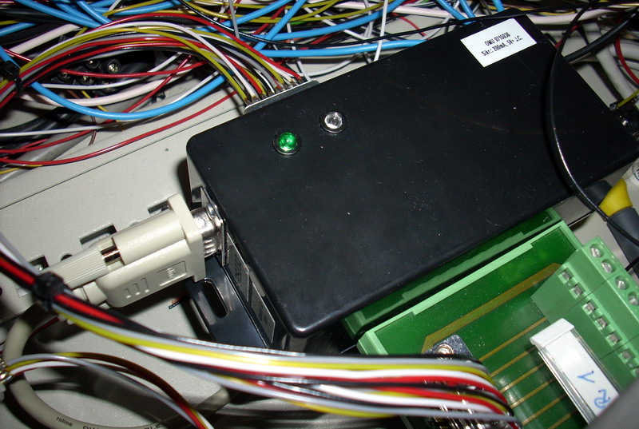

## Source code for project: [Serial port IO module with 15 inputs](https://link.stdout.no/m)

Serial port interface for 15 digital inputs, uses an AVR ATmega8 microcontroller.

Written in basic, using [Bascom-AVR](http://www.mcselec.com/).

### Author
[Thomas Jensen](https://thomas.stdout.no)
